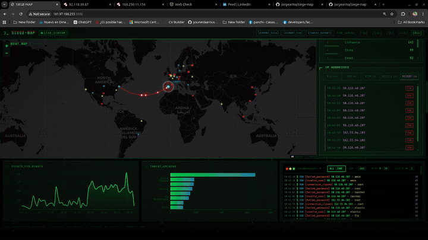
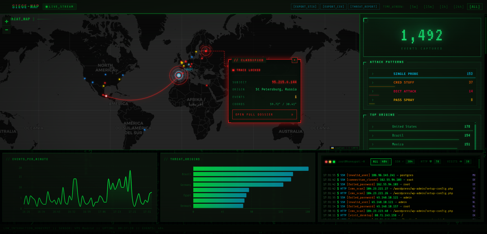
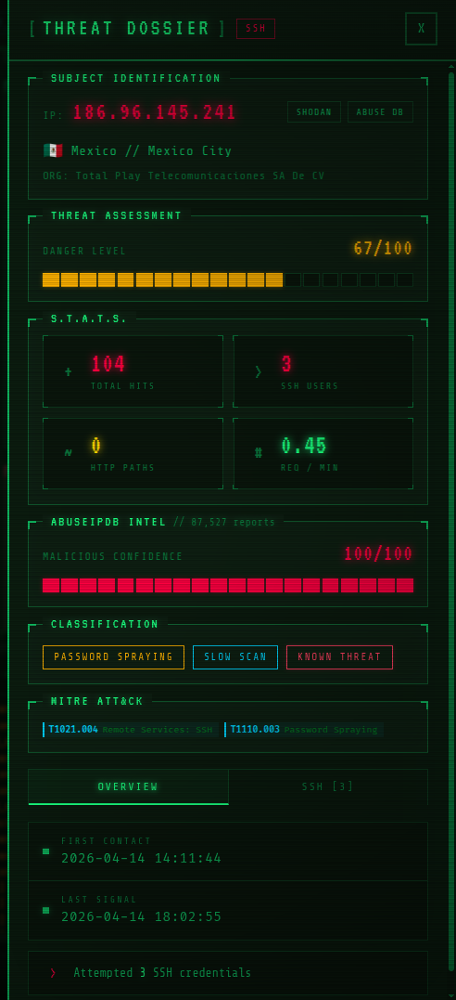

# siege map

**Visualizador de ataques SSH/HTTP en tiempo real .**
Lee logs de SSH y Nginx, geolocaliza las IPs, las clasifica con MITRE ATT&CK y las pinta en un mapa mundial con arcos animados, particulas de datos y un dashboard estilo terminal retro-futurista.

Pensado para correr en cualquier VPS con un solo `docker compose up`.



---

## Que hace exactamente

### En el mapa (panel principal)
- Mapa Leaflet oscuro con **arcos animados** desde el origen del ataque hasta tu VPS.
- **Particulas de datos** viajando por los arcos con fragmentos hex (`0xCAFE`, `SYN>>`, etc).
- **Reticula del VPS** con lineas de cruz, anillos rotativos y label `TARGET`.
- Cada IP atacante aparece como un **punto pulsante** del color de su tipo de ataque (rojo SSH, amarillo HTTP, azul visitas reales).
- Click en un punto -> **callout estilo espia** con linea de telemetria SVG animada, datos del subject (IP, origen, eventos, coordenadas) y boton `OPEN FULL DOSSIER` que abre el drawer completo.




### Sidebar (stats panel)
Todas las cards con tema Pip-Boy: bordes con corner brackets, headers flotantes, scanlines CRT, fuente VT323.
- **Total counter** con efecto de glitch ocasional (calavera ASCII y mensajes tipo `BREACH_DETECTED`).
- **Attack patterns**: `DICTIONARY_ATTACK`, `CREDENTIAL_STUFFING`, `PASSWORD_SPRAYING`, `SINGLE_PROBE`.
- **Top origins** por pais con barras animadas.
- **IP addresses** con tabs (ALL / SSH / HTTP / VISITS / RECENT). Click en cualquier IP abre el drawer.
- **SSH targets**: nube de tags con todos los usernames probados en rojo.
- **HTTP routes**: separados en `BOTS` (probes a `/wp-admin`, `/.git`, etc) y `REAL` (rutas que tu app realmente sirve).
- **Recent events**: ultimos 10 hits con timestamp, IP y tipo.

### Drawer de perfil de atacante
Cuando clickeas una IP (en el mapa, en la lista o en el feed):
- Header `THREAT DOSSIER` con badge SSH/HTTP/SSH+HTTP.
- **Subject identification**: IP grande, geo, ASN/org, links a Shodan y AbuseIPDB.
- **Threat assessment** con `PipBoyMeter` segmentado (20 bloques tipo barra de salud).
- **Vault stats**: cards con esquinas L para total hits, SSH users, HTTP paths, req/min.
- **AbuseIPDB intel** con porcentaje de confianza y total de reportes.
- **Classification**: pattern + speed + KNOWN_THREAT badge si es notorio.
- **MITRE ATT&CK** badges con TTPs identificados.
- Tabs OVERVIEW (timeline + summary), SSH (todos los usernames probados), HTTP (rutas con status code y conteo).



### Feed en vivo
Stream WebSocket con cada evento conforme entra: timestamp, IP, pais con flag, tipo, severidad. Filtros por SSH/HTTP/REAL.

### API REST + Export
- `GET /api/health` — health check.
- `GET /api/events?limit=` — eventos crudos.
- `GET /api/stats/{total,countries,ips,usernames,http-routes,patterns,asns,heatmap}?window=`.
- `GET /api/attacker/{ip}` — perfil completo.
- `GET /api/attackers?limit=&window=` — ranking por threat score.
- `GET /api/export/stix?window=` — bundle STIX 2.1 descargable.
- `GET /api/export/csv?window=` — eventos en CSV.
- `GET /api/export/report?window=` — resumen ejecutivo JSON.

---

## Levantarlo en 30 segundos

```bash
git clone <este-repo>
cd ssh-bot-rain-map
cp .env.example .env
# Edita .env (ver "Adaptar a tu entorno" abajo)
docker compose up -d --build
```

Luego abre:
- Dashboard: `http://localhost:3000` (o `http://<tu-vps-ip>:3000`)
- API: `http://localhost:8000/api/health`

### Modo desarrollo (con logs sinteticos)
Si estas probando localmente y no tienes acceso a logs reales:

```bash
docker compose -f docker-compose.dev.yml up -d --build
# En otra terminal, genera trafico falso:
python scripts/fake_ssh_log.py --output ./logs/auth.log --rate 2.0
```

El compose dev monta `./logs/auth.log` en lugar de los logs del host.

---

## Adaptar a tu entorno

Todo lo que probablemente quieras tocar.

### 1. Variables de entorno (`.env`)

| Variable | Default | Que cambiar y por que |
|----------|---------|------------------------|
| `SSH_LOG_PATH` | `/var/log/auth.log` | **Obligatorio**. Debian/Ubuntu usa `auth.log`, RHEL/CentOS/Fedora usa `/var/log/secure`. |
| `NGINX_LOG_PATH` | `/var/log/nginx/access.log` | Opcional. Si no usas Nginx dejalo vacio o apunta a tu access log (Apache funciona si esta en formato combined). |
| `VPS_LAT` | `40.4168` | **Obligatorio**. Latitud de tu VPS — donde caera la "lluvia" de arcos. |
| `VPS_LON` | `-3.7038` | **Obligatorio**. Longitud de tu VPS. |
| `VPS_LABEL` | `My VPS` | Texto que veras en el popup del marker del VPS. |
| `GEO_PROVIDER` | `ip-api` | `ip-api` (gratis, 45 req/min) o `ipinfo` (mejor calidad, requiere token). |
| `IPINFO_TOKEN` | _(vacio)_ | Solo si `GEO_PROVIDER=ipinfo`. Token gratis en [ipinfo.io](https://ipinfo.io/). |
| `ABUSEIPDB_API_KEY` | _(vacio)_ | Opcional. Activa enriquecimiento de reputacion. Free tier: 1000 checks/dia. |
| `SHODAN_API_KEY` | _(vacio)_ | Opcional. Datos extra de puertos/OS/vulns. |
| `MAX_EVENTS` | `10000` | Eventos en memoria (cola circular). Sube si tienes mucho trafico y quieres ventanas largas. |
| `GEO_CACHE_TTL` | `86400` | TTL del cache de geo en segundos (24h por defecto). |
| `ABUSE_CACHE_TTL` | `86400` | TTL del cache de AbuseIPDB. |
| `WS_BROADCAST_INTERVAL` | `1.0` | Cadencia de envio por WebSocket en segundos. Sube a `2.0` si tu CPU sufre. |
| `FRONTEND_PORT` | `3000` | Puerto del dashboard. Cambialo si ya tienes algo en 3000. |
| `BACKEND_PORT` | `8000` | Puerto del backend FastAPI. |

### 2. Rutas HTTP "legitimas" de tu app
**Importante** si tienes Nginx sirviendo una web propia. Por defecto cualquier ruta no listada se marca como `BOT_PROBE` (amarillo). Para que tus rutas reales aparezcan en azul como visitas legitimas:

Edita `frontend/src/config/knownRoutes.js` y añade tus rutas:

```js
export const KNOWN_ROUTES = [
  '/',
  '/about',
  '/api/...',
  // tus rutas aqui
]
```

### 3. Coordenadas del VPS
Si no sabes la lat/lon de tu servidor, usa `curl ifconfig.co/json` desde el VPS o consulta el panel de tu proveedor (Hetzner, DigitalOcean, OVH, etc).

### 4. Frontend en host distinto al backend
Si despliegas frontend y backend en hosts separados (no recomendado para esta app, pero posible):
- Edita `frontend/src/hooks/useWebSocket.js` para apuntar al WS correcto (`ws://tu-backend:8000/ws`).
- Edita `frontend/vite.config.js` (`proxy.target`) para el modo dev.
- En produccion el `nginx.conf` del frontend asume backend en el servicio docker llamado `backend`. Cambialo si tu setup es distinto.

### 5. Si tu VPS ya usa los puertos 3000/8000
Cambia `FRONTEND_PORT` y `BACKEND_PORT` en `.env` o edita los port mappings en `docker-compose.yml`. Por ejemplo:

```yaml
frontend:
  ports:
    - "8080:80"   # accede en :8080
```

### 6. Permisos del log de SSH
El backend lee el log montado como read-only. En la mayoria de distros `auth.log` pertenece a `root:adm` o `root:syslog`. Si el contenedor no puede leerlo:

```bash
sudo chmod o+r /var/log/auth.log
# o ajusta el user del contenedor en docker-compose.yml
```

### 7. Personalizar la apariencia
- **Tema Pip-Boy**: las variables CSS estan al inicio de `frontend/src/styles/app.css` (`--pip-green`, `--pip-amber`, `--pip-bg`, etc). Cambialas para tener tu propia paleta.
- **Colores de tipos de ataque**: definidos en `frontend/src/components/WorldMap.jsx` (`SSH_COLOR`, `HTTP_COLOR`, `VISITOR_COLOR`).
- **Mensajes de glitch**: edita `GLITCH_LINES` en `frontend/src/components/StatsPanel.jsx`.

---

## Arquitectura

```
SSH/Nginx log --tail-F--> FastAPI ingesta
                              |
                              +--> parser (regex) --> SSHEvent / HttpEvent
                              |
                              +--> geo enrichment (ip-api / ipinfo, cached)
                              |
                              +--> threat intel (AbuseIPDB, opcional, cached)
                              |
                              +--> analyzer (patterns + MITRE TTPs)
                              |
                              +--> EventStore (deque circular en memoria)
                              |
                              +--> WebSocket broadcast (1s) --> React UI
                              |
                              +--> REST API (stats, profile, export)
```

### Backend (`backend/app/`)
- `main.py` — FastAPI, dos tasks asincronas: `process_log_lines()` y `flush_loop()`.
- `tail.py` — `async for line in tail_log(path)`, sobrevive a logrotate.
- `parser.py` — regex SSH + HTTP (Nginx combined).
- `geo.py` — geolocalizacion con cache TTL.
- `threat_intel.py` — AbuseIPDB con rate limit (1 req/s, 900/dia).
- `analyzer.py` — clasificador heuristico, MITRE ATT&CK, heatmap 7x24.
- `stix_export.py` — bundle STIX 2.1 sin dependencia externa.
- `store.py` — `EventStore` con deque circular y dedupe por minuto.
- `models.py` — dataclasses `SSHEvent`, `HttpEvent`, `GeoInfo`.
- `config.py` — singleton `settings` que lee `.env`.

### Frontend (`frontend/src/`)
- `App.jsx` — root, gestiona estado de eventos y drawer.
- `components/WorldMap.jsx` — Leaflet + canvas particles + IntelCallout (spy card con linea SVG).
- `components/StatsPanel.jsx` — stats tipo Pip-Boy con tabs y nube de tags.
- `components/AttackerProfile.jsx` — drawer 440px con dossier completo.
- `components/EventFeed.jsx` — feed scrolleable en vivo.
- `components/Charts.jsx` — timeline Recharts.
- `components/HeatmapChart.jsx` — grid 7x24 (dia x hora).
- `components/ExportPanel.jsx` — botones STIX / CSV / REPORT.
- `components/MitreBadge.jsx` — badge reutilizable de TTP.
- `hooks/useWebSocket.js` — gestion de conexion WS.
- `config/knownRoutes.js` — whitelist de rutas legitimas.
- `styles/app.css` — todo el tema Pip-Boy + animaciones.

---

## Buenas practicas incorporadas

- `tail -F` con reintento automatico, sobrevive a `logrotate`.
- **Cache** y **rate limit** para geo (45 req/min) y AbuseIPDB (1 req/s, 900/dia).
- **Deduplicacion** ligera (`ip:user:type:minute`) para no inflar metricas.
- **Heuristica multi-factor** combinando velocidad (rpm), patron, diversidad de usernames y reputacion externa.
- Volumen del log montado **read-only** en el contenedor.
- Sin DB: todo en memoria con deque acotado (no hay nada que limpiar al reiniciar).

---

## Operacion y troubleshooting

```bash
# Health check
curl http://localhost:8000/api/health

# Logs en vivo
docker compose logs -f backend
docker compose logs -f frontend

# Datos crudos
curl http://localhost:8000/api/events?limit=20
curl http://localhost:8000/api/stats/total

# Reset (sin perder logs del host)
docker compose restart backend

# Rebuild despues de tocar codigo
docker compose up -d --build
```

**No veo eventos:**
1. ¿El contenedor lee el log? `docker compose exec backend cat $SSH_LOG_PATH | head` (deberia funcionar).
2. ¿Hay actividad real? Genera con `python scripts/fake_ssh_log.py --output ./logs/auth.log --rate 2.0` en modo dev.
3. ¿Las coordenadas del VPS son correctas? Si estan a `0,0` el mapa centrara al medio del oceano.

**Geo dice "Unknown":**
- ip-api tiene rate limit. Espera o cambia a ipinfo con token.
- IPs privadas (`10.x`, `192.168.x`) no se geolocalizan a proposito.

**Frontend no conecta WS:**
- Mira la consola del navegador. Si hay `404` en `/ws`, revisa que el proxy de Vite o el `nginx.conf` apunten al backend correcto.

---

## Roadmap

- Persistencia opcional (SQLite/DuckDB) para historicos largos y replay.
- Multi-sensor: agregar varios VPS en un solo dashboard.
- Webhooks/Slack alerts en base a threat score.
- Modo claro (heretico pero por completitud).
- TLS/auth para exponer el dashboard publicamente.

---

## Licencia

MIT. Forkalo, adaptalo,.
